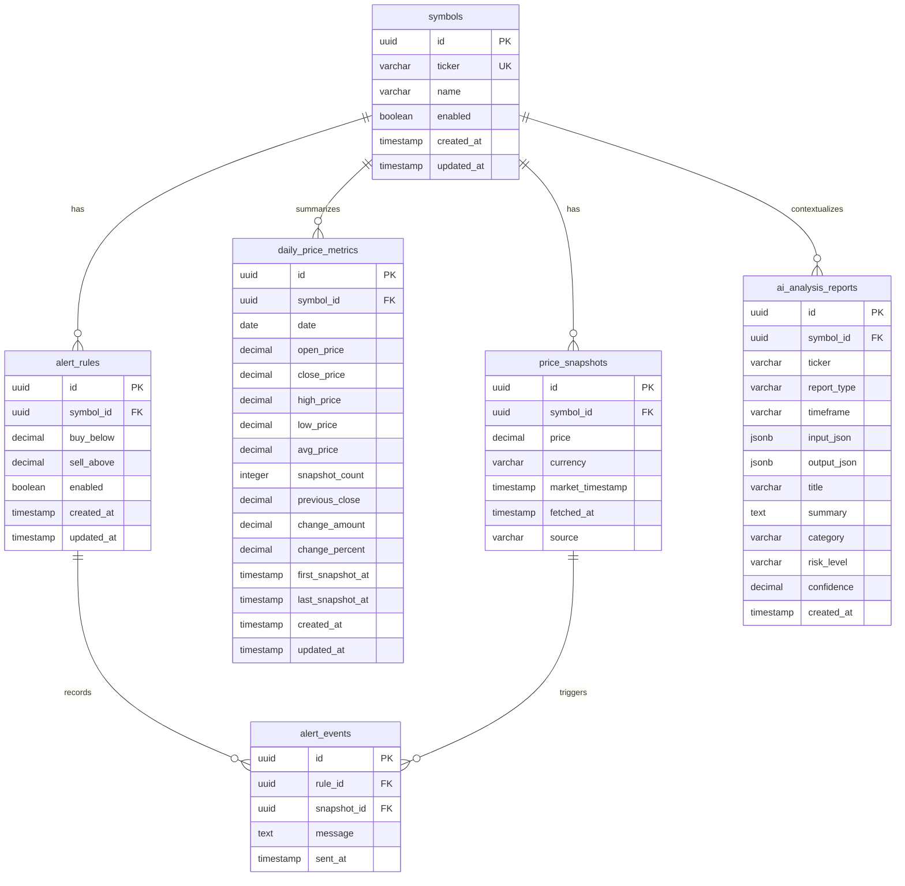

# Database Schema

## Database Purpose

This project uses PostgreSQL as the durable storage layer for a personal stock and ETF monitoring service.

The database stores:

- The watchlist symbols observed by the app.
- Append-only historical price snapshots captured from Finnhub WebSocket Trades.
- Daily price metrics recalculated from snapshots for fast analysis.
- Threshold alert rules for buy-below and sell-above signals.
- Alert delivery history, so future alert logic can track sent notifications and avoid excessive duplicate messages.
- AI analysis reports generated from stored daily metrics and compact DB-derived inputs.

The app uses Prisma for schema management and type-safe access. The configured database is `stock_watcher` in Docker, using the `public` schema through `DATABASE_URL`.

## Runtime Data Flow

1. The scheduler keeps a Finnhub trade stream open during the configured market window.
2. Every configured interval, the stock fetch job reads the latest snapshot-eligible trade prices from the in-memory stream cache.
3. `PriceSnapshotService.storeQuotes()` upserts each symbol by ticker.
4. The service appends a new row to `price_snapshots` for each quote.
5. The daily metric service recalculates and upserts one `daily_price_metrics` row for the affected symbol and local calendar day.
6. The in-memory daily metric cache is refreshed from the upserted metric.
7. Live price-drop alerts compare Finnhub trade prices against cached daily metrics without adding per-tick database work.
8. The AI worker can read stored daily metrics, classify watchlist symbols, call Ollama, and save one scheduled report row to `ai_analysis_reports`.
9. Generic buy/sell alert tables are already modeled, but generic alert rule evaluation is not implemented yet.

## Entity Relationship Overview

## Tables

### `symbols`

Stores the symbols that the app knows about. Symbols are upserted automatically when live quotes are persisted, so this table represents the active and historical symbol catalog.

| Column | Type | Nullable | Default | Purpose |
| --- | --- | --- | --- | --- |
| `id` | `UUID` | No | Generated UUID | Primary key. |
| `ticker` | `VARCHAR(20)` | No | None | Unique stock or ETF ticker used by the price provider, for example `NVDA` or `SPCX`. |
| `name` | `VARCHAR(255)` | Yes | None | Optional human-readable symbol name. Currently not populated by the app. |
| `enabled` | `BOOLEAN` | No | `true` | Marks whether the symbol is active. Current snapshot persistence sets this to `true` on upsert. |
| `created_at` | `TIMESTAMP(3)` | No | `CURRENT_TIMESTAMP` | Row creation timestamp. |
| `updated_at` | `TIMESTAMP(3)` | No | Prisma `@updatedAt` | Row update timestamp. |

Constraints and indexes:

- Primary key: `symbols_pkey` on `id`.
- Unique index: `symbols_ticker_key` on `ticker`.

### `price_snapshots`

Stores append-only historical price records. Each row is one observed latest price for one symbol at one scheduled snapshot run. Historical records are not overwritten.

| Column | Type | Nullable | Default | Purpose |
| --- | --- | --- | --- | --- |
| `id` | `UUID` | No | Generated UUID | Primary key. |
| `symbol_id` | `UUID` | No | None | Foreign key to `symbols.id`. |
| `price` | `DECIMAL(18,4)` | No | None | Captured latest trade price. |
| `currency` | `VARCHAR(10)` | No | None | Quote currency from the app quote object. |
| `market_timestamp` | `TIMESTAMP(3)` | No | None | Timestamp associated with the market/trade data. |
| `fetched_at` | `TIMESTAMP(3)` | No | `CURRENT_TIMESTAMP` | Timestamp when the snapshot row was inserted. |
| `source` | `VARCHAR(50)` | No | None | Price source, currently Finnhub trade stream data. |

Constraints and indexes:

- Primary key: `price_snapshots_pkey` on `id`.
- Foreign key: `price_snapshots_symbol_id_fkey`, `symbol_id` references `symbols.id`.
- Index: `price_snapshots_symbol_id_fetched_at_idx` on `symbol_id, fetched_at`.

### `daily_price_metrics`

Stores one recalculated summary row per symbol per local calendar day. The row is upserted after each successful snapshot insert, so it acts like the current daily ledger for charts and analytics.

| Column | Type | Nullable | Default | Purpose |
| --- | --- | --- | --- | --- |
| `id` | `UUID` | No | Generated UUID | Primary key. |
| `symbol_id` | `UUID` | No | None | Foreign key to `symbols.id`. |
| `date` | `DATE` | No | None | Local calendar date in the configured app timezone. |
| `open_price` | `DECIMAL(18,4)` | No | None | First snapshot price for the symbol on that date. |
| `close_price` | `DECIMAL(18,4)` | No | None | Latest snapshot price for the symbol on that date. |
| `high_price` | `DECIMAL(18,4)` | No | None | Highest snapshot price for the symbol on that date. |
| `low_price` | `DECIMAL(18,4)` | No | None | Lowest snapshot price for the symbol on that date. |
| `avg_price` | `DECIMAL(18,4)` | No | None | Average snapshot price for the symbol on that date. |
| `snapshot_count` | `INTEGER` | No | None | Number of snapshots included in the daily metric. |
| `previous_close` | `DECIMAL(18,4)` | Yes | None | Most recent prior daily close for the same symbol. |
| `change_amount` | `DECIMAL(18,4)` | Yes | None | `close_price - previous_close`. |
| `change_percent` | `DECIMAL(10,4)` | Yes | None | Percent change from previous close. |
| `first_snapshot_at` | `TIMESTAMP(3)` | No | None | Timestamp of the first included snapshot. |
| `last_snapshot_at` | `TIMESTAMP(3)` | No | None | Timestamp of the latest included snapshot. |
| `created_at` | `TIMESTAMP(3)` | No | `CURRENT_TIMESTAMP` | Row creation timestamp. |
| `updated_at` | `TIMESTAMP(3)` | No | Prisma `@updatedAt` | Row update timestamp. |

Constraints and indexes:

- Primary key: `daily_price_metrics_pkey` on `id`.
- Unique index: `daily_price_metrics_symbol_id_date_key` on `symbol_id, date`.
- Index: `daily_price_metrics_date_idx` on `date`.
- Index: `daily_price_metrics_symbol_id_date_idx` on `symbol_id, date`.

### `alert_rules`

Stores threshold rules for future alert evaluation. Each rule belongs to one symbol and can contain a buy threshold, a sell threshold, or both.

| Column | Type | Nullable | Default | Purpose |
| --- | --- | --- | --- | --- |
| `id` | `UUID` | No | Generated UUID | Primary key. |
| `symbol_id` | `UUID` | No | None | Foreign key to `symbols.id`. |
| `buy_below` | `DECIMAL(18,4)` | Yes | None | Price threshold for buy alerts. |
| `sell_above` | `DECIMAL(18,4)` | Yes | None | Price threshold for sell alerts. |
| `enabled` | `BOOLEAN` | No | `true` | Enables or disables the rule. |
| `created_at` | `TIMESTAMP(3)` | No | `CURRENT_TIMESTAMP` | Row creation timestamp. |
| `updated_at` | `TIMESTAMP(3)` | No | Prisma `@updatedAt` | Row update timestamp. |

Constraints and indexes:

- Primary key: `alert_rules_pkey` on `id`.
- Foreign key: `alert_rules_symbol_id_fkey`, `symbol_id` references `symbols.id`.
- Index: `alert_rules_symbol_id_enabled_idx` on `symbol_id, enabled`.

### `alert_events`

Stores sent alert notifications. This table is intended to provide an audit trail and support duplicate-notification control once alert evaluation is implemented.

| Column | Type | Nullable | Default | Purpose |
| --- | --- | --- | --- | --- |
| `id` | `UUID` | No | Generated UUID | Primary key. |
| `rule_id` | `UUID` | No | None | Foreign key to the alert rule that triggered the notification. |
| `snapshot_id` | `UUID` | No | None | Foreign key to the price snapshot that triggered the notification. |
| `message` | `TEXT` | No | None | Notification message that was sent. |
| `sent_at` | `TIMESTAMP(3)` | No | `CURRENT_TIMESTAMP` | Timestamp when the alert was sent or recorded. |

Constraints and indexes:

- Primary key: `alert_events_pkey` on `id`.
- Foreign key: `alert_events_rule_id_fkey`, `rule_id` references `alert_rules.id`.
- Foreign key: `alert_events_snapshot_id_fkey`, `snapshot_id` references `price_snapshots.id`.
- Index: `alert_events_rule_id_sent_at_idx` on `rule_id, sent_at`.

### `ai_analysis_reports`

Stores AI-generated analysis reports. The current implementation saves one row per scheduled report, with `symbol_id` and `ticker` left null. `input_json` contains the compact DB-derived classified input, and `output_json` contains the normalized LLM response.

| Column | Type | Nullable | Default | Purpose |
| --- | --- | --- | --- | --- |
| `id` | `UUID` | No | Generated UUID | Primary key. |
| `symbol_id` | `UUID` | Yes | None | Optional foreign key to `symbols.id` for future per-symbol reports. Current scheduled reports use `NULL`. |
| `ticker` | `VARCHAR(40)` | Yes | None | Optional ticker for future per-symbol reports. Current scheduled reports use `NULL`. |
| `report_type` | `VARCHAR(40)` | No | None | Report type, currently `pre_market_daily`. |
| `timeframe` | `VARCHAR(20)` | No | None | Report timeframe, currently `1d`. |
| `input_json` | `JSONB` | No | None | Compact DB-derived input passed to the LLM after deterministic classification. |
| `output_json` | `JSONB` | Yes | None | Normalized structured LLM output. |
| `title` | `VARCHAR(200)` | No | None | Report title. |
| `summary` | `TEXT` | No | None | Final formatted report text used for Telegram and quick display. |
| `category` | `VARCHAR(30)` | Yes | None | Optional top-level category. Current scheduled reports generally use `NULL`. |
| `risk_level` | `VARCHAR(30)` | Yes | None | Optional top-level risk level. Current scheduled reports generally use `NULL`. |
| `confidence` | `DECIMAL(5,4)` | Yes | None | Optional confidence value reserved for future use. |
| `created_at` | `TIMESTAMP(3)` | No | `CURRENT_TIMESTAMP` | Row creation timestamp. |

Constraints and indexes:

- Primary key: `ai_analysis_reports_pkey` on `id`.
- Foreign key: `ai_analysis_reports_symbol_id_fkey`, `symbol_id` references `symbols.id` with `ON DELETE SET NULL`.
- Index: `ai_analysis_reports_symbol_id_timeframe_created_at_idx` on `symbol_id, timeframe, created_at`.
- Index: `ai_analysis_reports_report_type_created_at_idx` on `report_type, created_at`.

## Relationships

### `symbols` to `price_snapshots`

- Relationship: one-to-many.
- One symbol can have many price snapshots.
- Each price snapshot belongs to exactly one symbol.
- Delete behavior: restricted by the database foreign key.
- Update behavior: cascades if the symbol primary key changes.

Purpose: preserve a full price history per ticker for charting, analytics, and future AI-assisted insights.

### `symbols` to `daily_price_metrics`

- Relationship: one-to-many.
- One symbol can have many daily price metric rows.
- Each daily metric belongs to exactly one symbol and date.
- Delete behavior: restricted by the database foreign key.
- Update behavior: cascades if the symbol primary key changes.

Purpose: keep fast daily summaries for trend analysis, movers lists, and future dashboard queries.

### `symbols` to `alert_rules`

- Relationship: one-to-many.
- One symbol can have many alert rules.
- Each alert rule belongs to exactly one symbol.
- Delete behavior: restricted by the database foreign key.
- Update behavior: cascades if the symbol primary key changes.

Purpose: attach configurable buy/sell thresholds to each watched ticker.

### `alert_rules` to `alert_events`

- Relationship: one-to-many.
- One alert rule can produce many alert events over time.
- Each alert event belongs to exactly one alert rule.
- Delete behavior: restricted by the database foreign key.
- Update behavior: cascades if the alert rule primary key changes.

Purpose: audit alert deliveries and support duplicate-notification policies.

### `price_snapshots` to `alert_events`

- Relationship: one-to-many.
- One price snapshot can be associated with many alert events.
- Each alert event belongs to exactly one price snapshot.
- Delete behavior: restricted by the database foreign key.
- Update behavior: cascades if the price snapshot primary key changes.

Purpose: connect each sent alert back to the exact observed price that triggered it.

### `symbols` to `ai_analysis_reports`

- Relationship: optional one-to-many.
- One symbol can be associated with many future per-symbol AI reports.
- Current scheduled reports are whole-watchlist reports and use `NULL` for `symbol_id`.
- Delete behavior: `ON DELETE SET NULL`.
- Update behavior: cascades if the symbol primary key changes.

Purpose: preserve room for future single-symbol AI reports while supporting the current whole-report storage model.

## Current Implementation Notes

- The database provider is PostgreSQL.
- Prisma models are defined in `prisma/schema.prisma`.
- The initial migration is `prisma/migrations/20260616000000_initial_schema/migration.sql`.
- Daily metrics were added in `prisma/migrations/20260617000000_add_daily_price_metrics/migration.sql`.
- AI analysis reports were added in `prisma/migrations/20260622000000_add_ai_analysis_reports/migration.sql`.
- The AI worker writes scheduled report rows through Prisma raw SQL to avoid depending on regenerated Prisma client types during local iteration.
- Docker Compose provisions PostgreSQL 16 Alpine with database/user/password all set to `stock_watcher`.
- `price_snapshots` is the main active table today.
- `daily_price_metrics` is recalculated after each successful snapshot insert.
- `DailyPriceMetricCache` is an in-memory runtime cache and is not persisted as a table.
- `symbols` is actively used through an upsert before inserting snapshots.
- Live price-drop alerts use configuration and cached daily metrics; they do not currently write to `alert_events`.
- `alert_rules` and `alert_events` exist for planned generic alert functionality, but `AlertRuleService.evaluateQuotes()` is currently not implemented.
- There is no user/account table. This is a single-user personal monitoring database.
- There is no portfolio/holding table yet. Portfolio analytics are future scope.
